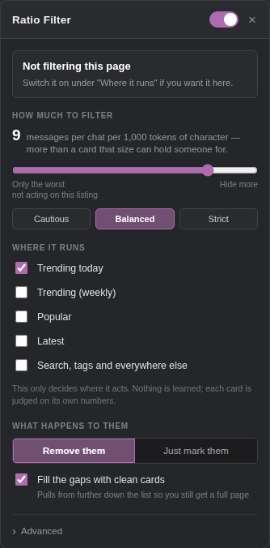

# J.AI Bot Filter

Hides botted JanitorAI cards and backfills the gaps with clean ones, so you still get a
full page.

A userscript — Firefox, Chrome, anything Tampermonkey runs on.



---

## Install

1. Install [Tampermonkey](https://www.tampermonkey.net/) or
   [Violentmonkey](https://violentmonkey.github.io/).
2. Open **[jai-bot-filter.user.js](../../raw/main/jai-bot-filter.user.js)** — your script
   manager will offer to install it.
3. Open JanitorAI. A ⚖ button appears bottom-right.

It updates itself from this repo, so you install once.

---

## The maths

Two signals. Neither decides alone.

### 1. Depth — is there enough card to talk that long?

A long conversation needs material, and the card's definition *is* that material. The API
reports its size as `total_tokens`, so:

```
depth = (messages / chats) / total_tokens × 1000 / days^0.28
```

Messages per chat, per 1,000 tokens of character. A thin card can't hold anyone for fifteen
messages, so when it reports that it did, something else produced them.

The age term isn't optional. Across 401 live cards, median messages-per-chat is 8.4 in a
card's first two days and 30.8 past a year, on the same amount of character. Without
`days^0.28` a threshold tuned on 24-hour trending flags 91% of the Popular listing.

### 2. Silence — thousands of chats, and nobody said anything

```
comments per 1k = comments / chats × 1000
```

Chats are cheap to manufacture; somebody writing a sentence underneath is not. This catches
a family of bots that look completely ordinary on depth — three of the confirmed cases
score 1.7, 3.3 and 3.5 there, and nothing else in the filter can see them.

### How a verdict is reached

| | |
|---|---|
| depth over **15** | **hidden** |
| depth over **11** | hidden **if** the comment rate agrees, else *marked* |
| depth over **9.4** | *marked*, hidden only if the comment rate agrees |
| **1,000–7,000 chats** with under **3** comments per 1k | **hidden** |
| **10,000+ chats** | never hidden on depth — only marked |
| under **200 chats** | hidden only with 1,000+ tokens of definition, else marked |
| under **50 chats** | not judged |

*Marked* means shown with an amber outline and the number on the badge. Shift-click hides a
card for good; plain click marks it fine. Your call always wins.

---

## Why no single threshold

Every version of this that used one number failed, and the labelled set shows why:

| | depth |
|---|---|
| botted (9) | 1.7 – 42.0 |
| genuine (14) | 2.0 – 11.0 |

Those ranges almost entirely overlap. The closest pair across the line is **11.1 botted,
11.0 genuine** — one percent apart. No depth threshold separates them. Their comment rates
are 4.0 and 11.1, which does.

The same trap caught the comment rule. On the labelled set alone, "under 4 comments per
1,000 chats" separates perfectly. On 74 live cards it flags **73% of them**, including Gojo
Satoru, Levi Ackerman and ChatGPT Plus — because the comment rate falls hard with size:

| chats | median comments / 1k |
|---|---|
| 400 – 2,000 | 8.3 |
| 2,000 – 7,000 | 5.5 |
| 7,000 – 30,000 | 3.2 |
| 30,000 + | ~3.0 |

So it's scoped to the band where it was actually measured. Same story for the depth rule at
the top end: the seven live cards it misread were all tiny, famous utility cards (a
206-token Story Generator with 85,844 chats), which is what the 10,000-chat guard is for.

**Every threshold here is tied to the population it was measured on, and stops at the edge
of it.** That is the one lesson this project keeps relearning.

---

## About the session token

**In the default setup it is never read.** Depth comes from the listing the page already
fetched. The comment count is one extra request to a public endpoint, spent on a few cards
per page, sent with `credentials: 'omit'`.

Two optional things do need it, because page 2+ of the character API returns `401` without
it: gap-filling with replacement cards, and the *Similar cards* rule. When used, the token
is read from the cookie janitorai.com already set, sent **only to janitorai.com** exactly
as the site does, and never stored or logged anywhere. There is no server behind this — the
source is plain and unminified, search for `authToken`.

Turn off *"Fill the gaps with clean cards"* and no token is read at all.

---

## Please be sceptical of it

A flagged card is "far from normal for its size", not "proven botted". Known weak spots:

- **Under 200 chats**, one long conversation is most of the signal. Only cards with a real
  definition behind them are hidden there; the rest get an outline for you to settle.
- **The silence rule rests on nine genuine cards** in its band, and there were only two
  cards to measure between 7,000 and 30,000 chats. If it hides something you recognise,
  switch it off in the panel — that's a calibration bug, not your mistake.
- **Both signals are weakest on large, old cards**, where genuine ones go quiet and famous
  minimal ones score enormous depth. Those are downgraded to marks.
- **Everything was measured on trending and popular listings** — that's what's reachable
  without a login, and it isn't the whole site.

Start in **Just mark them**, use **Copy this page's numbers**, and check a few by hand
before switching to hiding.

---

## Notes

- Only the results grid is touched. **My Chats**, Recently viewed and other carousels are
  left alone.
- Replacements are appended, never inserted mid-grid, and are checked against the same
  rules first — a card that would itself be flagged is never used as filler.
- If JanitorAI changes its API, the filter goes quiet rather than flagging at random.
- Settings stay in your browser.

## Development

```
engine.js               API capture, the rules, hiding, replacement
panel.js                in-page panel (shadow DOM)
userscript-adapter.js   GM_* storage + Tampermonkey menu entries
build.sh                concatenates the three into jai-bot-filter.user.js
test/test.js            275 assertions
```

Edit the three sources, never `jai-bot-filter.user.js` — `build.sh` overwrites it.

```sh
npm install jsdom && node test/test.js   # tests
./build.sh                               # rebuild
```

To ship: bump `VERSION` in `build.sh`, run `./build.sh`, push to `main`. Tampermonkey only
offers an update when that number goes up, so forgetting to bump it means nobody gets the
change.

Storage keys still carry the old `jrf-` prefix on purpose — they're a data contract, and
renaming them on the rebrand would have dropped everyone's settings on upgrade.

## Licence

MIT — see [LICENSE](LICENSE).
